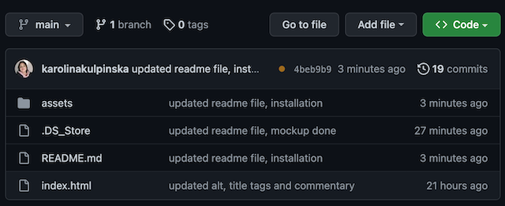
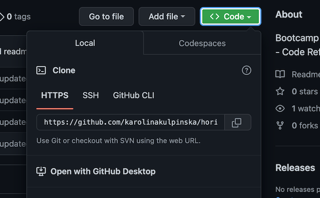

# Karolina Kulpinska - Personal Portfolio

## Description

This week my job was to design and code my personal portfolio website so that it meets typical hiring manager's needs:
* When the page is loaded the page presents my name, a recent photo or avatar, and links to sections about me, my work, and how to contact me;
* When one of the links in the navigation is clicked then the UI scrolls to the corresponding section;
* When viewing the section about my work then the section contains titled images of my applications;
* When presented with my first application then that application's image should be larger in size than the others;
* When images of the applications are clicked then the user is taken to that deployed application;
* When the page is resized or viewed on various screens and devices then the layout is responsive and adapts to my viewport.

I've also made sure that the application:
* loads with no errors;
* resembles the mockup functionality as close as possible;
* follows best practices for file structure and naming conventions as well as class/id naming conventions, indentation, quality comments, etc.

Link to deployed application: https://karolinakulpinska.github.io/my-portfolio-page/

## Mock-Up provided by the Company

The following animation shows the web application's appearance and functionality:


## Screenshot of my personal portfolio


## Installation

Please follow the steps below to access code and install the project:

1. Access https://github.com/karolinakulpinska/my-portfolio-page
2. Above the list of files, click on green 'Code' button. 

3. Copy the URL for the repository.
- To clone the repository using HTTPS, under "HTTPS", click two files button.

- To clone the repository using an SSH key, including a certificate issued by your organization's SSH certificate authority, click SSH, then click two files button.
- To clone a repository using GitHub CLI, click GitHub CLI, then click two files button.
4. Open Terminal.
5. Change the current working directory to the location where you want the cloned directory.
6. Type `git clone`, and then paste the URL you copied earlier.

```
$ git clone https://github.com/karolinakulpinska/my-portfolio-page.git

```
7. Press Enter to create your local clone.

```
$ git clone https://github.com/karolinakulpinska/my-portfolio-page.git
> Cloning into `Karolina-Kulpinska-personal-portfolio`...
> remote: Counting objects: 10, done.
> remote: Compressing objects: 100% (8/8), done.
> remove: Total 10 (delta 1), reused 10 (delta 1)
> Unpacking objects: 100% (10/10), done.

```

## Licence

MIT License

Copyright (c) 2022 Karolina Kulpinska 

Permission is hereby granted, free of charge, to any person obtaining a copy
of this software and associated documentation files (the "Software"), to deal
in the Software without restriction, including without limitation the rights
to use, copy, modify, merge, publish, distribute, sublicense, and/or sell
copies of the Software, and to permit persons to whom the Software is
furnished to do so, subject to the following conditions:

The above copyright notice and this permission notice shall be included in all
copies or substantial portions of the Software.

THE SOFTWARE IS PROVIDED "AS IS", WITHOUT WARRANTY OF ANY KIND, EXPRESS OR
IMPLIED, INCLUDING BUT NOT LIMITED TO THE WARRANTIES OF MERCHANTABILITY,
FITNESS FOR A PARTICULAR PURPOSE AND NONINFRINGEMENT. IN NO EVENT SHALL THE
AUTHORS OR COPYRIGHT HOLDERS BE LIABLE FOR ANY CLAIM, DAMAGES OR OTHER
LIABILITY, WHETHER IN AN ACTION OF CONTRACT, TORT OR OTHERWISE, ARISING FROM,
OUT OF OR IN CONNECTION WITH THE SOFTWARE OR THE USE OR OTHER DEALINGS IN THE
SOFTWARE.
